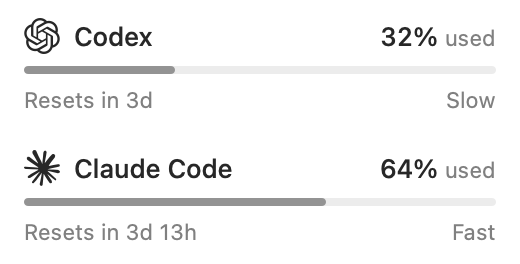
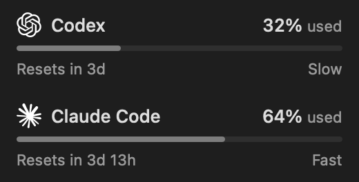

<p align="center"></p>

# Allowance

A quiet, native macOS menu-bar app for **Codex weekly** and **Claude Code weekly** allowance. Follows the account already signed in to each CLI.

[](https://github.com/MarlinDiary/allowance/actions/workflows/ci.yml)
[Download](https://github.com/MarlinDiary/allowance/releases) · [Data sources](CLAUDE_SOURCES.md) · [Changelog](CHANGELOG.md)

- Used percentage, reset countdown and **Slow · Steady · Fast** usage pace.
- A thin, read-only bar: **filled = used; empty = remaining**.
- Standard macOS notifications for Tibo's explicit reset announcements, confirmed resets and account switches.
- Native `NSMenu`, compact SwiftUI information rows, English UI. No dashboard, main window, separator lines, Refresh button or hover explanations.
- A layered Icon Composer app icon on macOS 26+: a clear-glass gauge, one silver arc over a faint track on a neutral grey glass backplate. Default and Dark appearances keep the same colours, matching the system's Clear icon style; older macOS gets a matching generated icon. The white template menu-bar symbol is unchanged.

<p> </p>

*Native component previews with fixture data, not full desktop screenshots.*

## Install

Requires **macOS 13 or later**. Download the universal Apple Silicon / Intel ZIP or DMG from [Releases](https://github.com/MarlinDiary/allowance/releases), move **Allowance.app** into Applications and open it. Existing CLI logins are used; there is no separate sign-in screen.

**From 0.6.17, downloads are Developer ID-signed and notarized by Apple, with the ticket stapled to both the app and the DMG.** Earlier previews were signed but not notarized; each release states its status. A developer certificate alone is not notarization. Do not assume an ad-hoc source build is a signed release.

Allow notifications when macOS asks. Later, change access in System Settings → Notifications → Allowance. Focus and system settings control presentation. The app does not modify launch-at-login settings.

The normal menu is information-only. **Command-Q while the menu is open** quits through a hidden native menu command, without a visible Quit row. This is not a global hotkey and never captures Command-Q from another foreground app. Activity Monitor also works. Background Keychain reads never show a system prompt; when Claude Code's saved login is not readable, Allowance quietly uses another source, and an **Allow Keychain Access…** command appears only when nothing else works.

## What the numbers mean

The percentage is **used** quota, the same share that fills the bar. Pace compares it with elapsed time in the seven-day window, with a five-percentage-point tolerance:

| Pace | Meaning |
| --- | --- |
| Slow | Usage is behind elapsed time. |
| Steady | Usage is approximately in step with elapsed time. |
| Fast | Usage is ahead of elapsed time. |

These words describe quota pace, not a model's fast mode or a prediction.

## Quiet, account-aware data

Codex reads its existing CLI login and weekly usage endpoint. Claude reads a fresh, account-matched weekly cache first, then existing OAuth credentials or an existing Safari / Claude Desktop web session. The web path verifies the server account and organization before fetching usage. Claude shows its overall weekly limit across models; a model-specific limit such as Fable is **never** substituted for it. Details: [CLAUDE_SOURCES.md](CLAUDE_SOURCES.md).

Every refresh trigger shares a persisted provider gate: after a provider answers, Codex waits at least two minutes and Claude at least five; a connection failure with no answer retries after 30 seconds. Each provider refreshes as soon as its gate reopens. Rate limits cause quiet backoff (5 / 10 / 20 / 30 minutes; a longer Retry-After wins), not repeated attempts through another data source. Recent cached readings stay quiet. Old readings say **last known** and **Delayed**; actionable sign-in and permission issues remain visible.

Changing the active CLI account changes only that provider: the previous account's reading disappears as soon as the CLI writes its login file, and the new account is fetched right away. Late responses from an old account are discarded. Finder launches use default CLI configuration paths; custom profiles require the corresponding launch environment.

### Reset notifications

The independent [CodexResets public feed](https://codex-resets.com/api/docs) is polled every five minutes with conditional ETag requests. Only explicit pending Tibo announcements and confirmed executions notify. Banked resets, forecasts and events older than a week are excluded. Passing a scheduled time alone does **not** confirm a reset; observed executions are labeled as observed.

The historical latest execution is silently baselined on first launch; a pending announcement can notify immediately. Announcement and execution IDs are persisted separately and deduplicated across restarts. Failed OS submissions retry on a later eligible poll. Feed failures add no menu error rows. Notifications describe the global feed, not proof that every account has updated. This is polling, not APNs.

### Account switch notifications

When the account signed in to Codex or Claude Code changes while Allowance is running, a standard notification names the new account, for example *Codex account switched — Allowance now shows usage for name@example.com.* Signing out and into another account counts, and so does moving Claude Code to another organization, since its weekly limit is per organization. The first account seen after launch, token renewals and signing back into the same account do not notify. A newer switch replaces the previous notice.

## Privacy

No analytics, telemetry, project-server credential upload, account creation, CLI subprocess/inference probes or credential refresh/write.

Existing login files, Keychain entries and browser session stores are read locally. Cookies are sent only to Claude, OAuth tokens only to their provider. Reset requests need no account credentials. One last-good snapshot and scheduling state per provider are saved in local app preferences, bound to account identity; reset notice IDs are also stored locally. Account email addresses are read from the CLIs' local login files only to name the account in a switch notification; they are never sent or stored. Diagnostics exclude tokens, emails and account identifiers.

Public source contains no local account data or signing credentials. Independently implemented; not affiliated with OpenAI, Anthropic or Apple. [MIT license](LICENSE) · [Provider artwork and trademarks](NOTICE.md)

## Build and test

Swift 6 / Xcode 16 or newer; **Xcode 26+ for layered icons**.

```sh
swift test
bash build.sh                 # universal; ad-hoc, not a distribution signature
python3 Scripts/verify-icon.py dist/Allowance.app
open dist/Allowance.app
./dist/Allowance.app/Contents/MacOS/Allowance --self-check
./dist/Allowance.app/Contents/MacOS/Allowance --source-check  # no HTTP
./dist/Allowance.app/Contents/MacOS/Allowance --live-check    # respects cooldown
```

`ALLOWANCE_ARCHS=arm64` builds only Apple Silicon. `ALLOWANCE_BUILD_DIR` changes scratch storage. `ALLOWANCE_ICON_STYLE=layered` requires real layered compilation; `legacy` explicitly builds the matching static SVG. Default `auto` uses Apple's layered compiler on Xcode 26+, otherwise the static fallback. Compiler failures are not silently hidden. The existing native menu route is unchanged.

See [contributing](CONTRIBUTING.md) and the [release checklist](docs/RELEASING.md). Internal Swift module names remain `QuotaMenu` / `QuotaCore` for continuity.

## Validation boundary

CI runs unit tests, app builds, self-checks and icon checks on macOS 15 and 26. Published universal builds are validated on the maintainer's Apple Silicon Mac. Intel runtime, macOS 13–14 runtime, full desktop appearance across all supported systems, and long-duration idle/energy behavior remain unvalidated.
